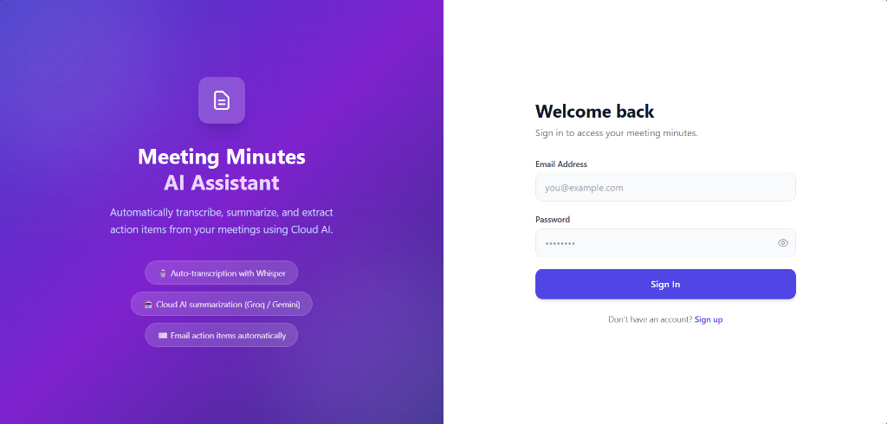
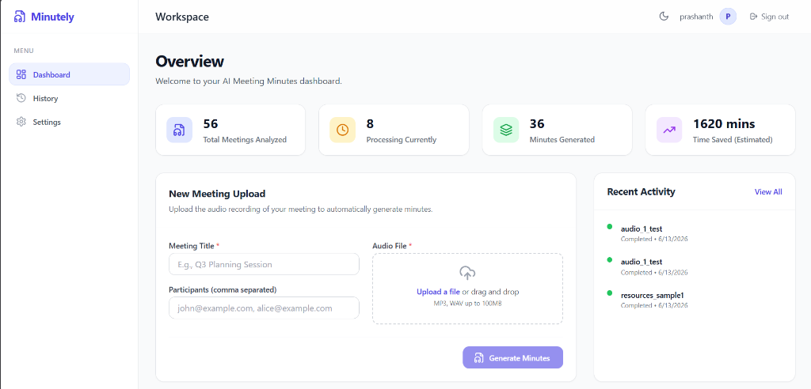
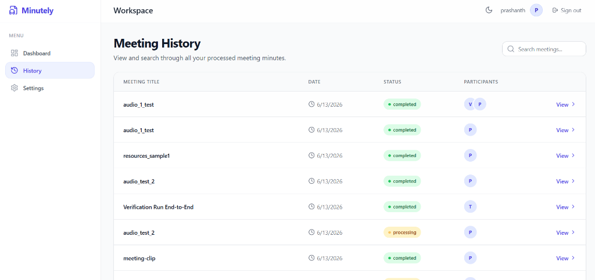
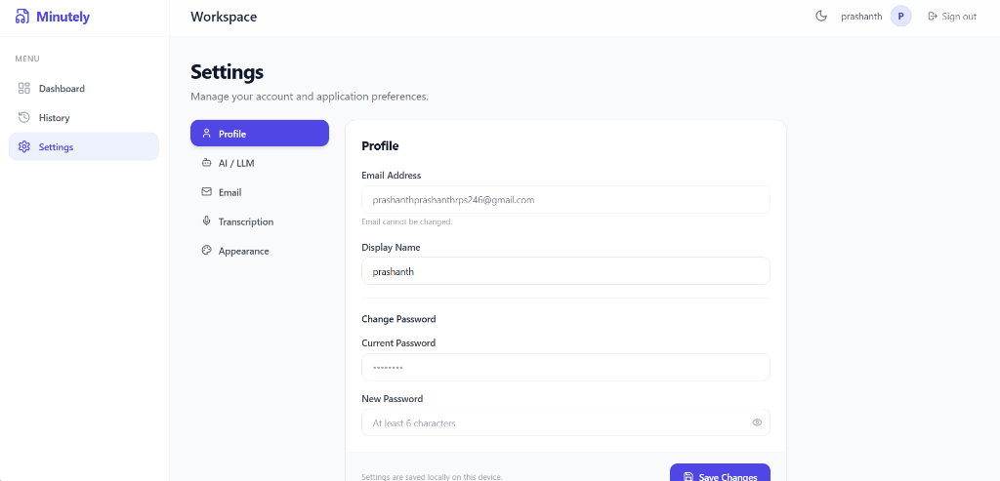
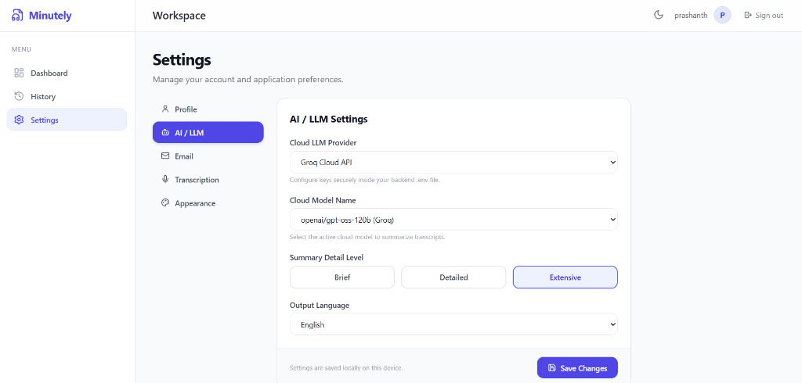
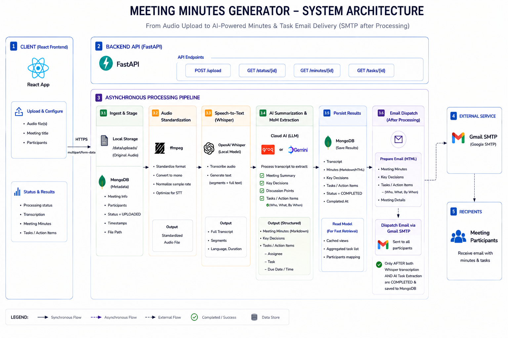

# 🎙️ Autonomous Meeting Minutes Generator

An advanced, self-contained AI-powered application that transcribes meeting audio recordings and automatically extracts structured meeting minutes—including summaries, decisions, action items, and agenda highlights—before distributing them to participants via email.

Built with a modern stack featuring **React (Vite, TypeScript, TailwindCSS)**, **FastAPI (Python)**, **MongoDB**, **OpenAI Whisper (Local)**, and **Cloud LLM APIs (Groq / Google Gemini)**.

---

## 📋 Table of Contents
- [🌟 Key Features](#-key-features)
- [📸 Screen Previews](#-screen-previews)
- [🏗️ System Architecture](#️-system-architecture)
- [🛠️ Tech Stack](#-tech-stack)
- [📁 Project Structure](#-project-structure)
- [🚀 Getting Started](#-getting-started)
  - [Prerequisites](#prerequisites)
  - [1. MongoDB Local Service](#1-mongodb-local-service)
  - [2. Cloud LLM Setup (Groq or Gemini)](#2-cloud-llm-setup-groq-or-gemini)
  - [3. Backend Server Setup](#3-backend-server-setup)
  - [4. Frontend Dashboard Setup](#4-frontend-dashboard-setup)
- [🔗 API Endpoints Contract](#-api-endpoints-contract)
- [⚙️ Environment Variables](#-environment-variables)
- [🔧 Troubleshooting & FAQ](#-troubleshooting--faq)
- [⭐ Support & Rate](#-support--rate)

---

## 🌟 Key Features

* **🎙️ Full-Audio Transcription**: Transcribes complex audio files locally using the OpenAI Whisper `base` model.
* **🧠 Structured MoM Extraction**: Leverages online cloud LLM inference (via Groq API or Google Gemini API) to extract:
  * Comprehensive meeting summary (10+ detailed lines).
  * Key decisions made.
  * Bulleted action items (tasks, owners, and deadlines).
* **✉️ Automated Email Distribution**: Dynamically drafts and dispatches clean, professionally styled HTML emails containing the meeting minutes to all participants upon completion.
* **📊 Modern Web Dashboard**: An interactive React-based UI that lists previous meetings, shows live processing states, and allows drag-and-drop file uploads.
* **🛡️ Self-Contained / Offline-Ready**: Bundles local `ffmpeg.exe` and `ffprobe.exe` binaries for seamless audio conversion without system-level Windows path configuration.

---

## 📸 Screen Previews

### 🔐 User Login
A secure login interface for users to authenticate and access their personal meeting minutes dashboard.


### 📊 Dashboard & Upload
The main workspace dashboard where you can track transcription metrics, view recent activities, and upload new meeting audio recordings.


### ⏳ Meeting History
A detailed overview of all processed and currently processing meetings, allowing you to search and quickly access past minutes.


### ⚙️ Settings & Configuration
The settings panel enables user profile management and configuring Cloud LLM providers (like Groq Cloud API and Google Gemini).
<p align="center">
  
  
</p>

---

## 🏗️ System Architecture



### 🔄 Data Pipeline Flow
1. **Upload**: React frontend sends audio files and configuration to the FastAPI backend.
2. **Ingest & Stage**: Audio is stored locally, metadata is registered in MongoDB, and an async background task is triggered.
3. **Speech-to-Text (Whisper)**: Local `ffmpeg` standardizes the audio format, and the OpenAI Whisper model transcribes the speech into text.
4. **Task & MoM Extraction (AI Summarization)**: Cloud AI (Groq or Gemini) processes the transcription text to extract structured meeting minutes, key decisions, and specifically compiles the list of **tasks/action items** (including who needs to do what and by when).
5. **SMTP Email Dispatch**: *Only* after both the Whisper transcription and AI task-extraction are fully complete and saved to MongoDB, the backend drafts the HTML email and dispatches the task list and minutes to all participants.

---

## 🛠️ Tech Stack

| Component | Technology | Purpose / Notes |
| :--- | :--- | :--- |
| **Frontend** | React (Vite), TypeScript, TailwindCSS | User interface, drag-and-drop upload, status tracker, meeting view |
| **Backend** | FastAPI (Python 3.10+) | High-performance asynchronous API, background workers |
| **Database** | MongoDB Community Server (v8+) | Persistent storage for meeting metadata, transcripts, and minutes |
| **Audio Processing** | PyDub | Formats incoming audio files into standard PCM WAV formats |
| **Speech-to-Text** | OpenAI Whisper (Local) | Secure, offline speech recognition (runs on local CPU/GPU) |
| **LLM Inference** | Groq API / Google Gemini API | Cloud-based structured JSON generation for summary, decisions, and tasks |
| **Email Service** | SMTP | Sends auto-generated emails (supports Gmail App Passwords) |

---

## 📁 Project Structure

```
meeting-minutes-ai/
├── frontend/               # React client application (Vite + TS)
│   ├── src/
│   │   ├── components/     # UI elements (Dashboard, Upload, MeetingView)
│   │   ├── services/       # apiClient modules (backend endpoints mapping)
│   │   ├── App.tsx         # App routing and layout skeleton
│   │   └── main.tsx        # React client entrypoint
│   ├── package.json        # NPM dependencies
│   ├── tailwind.config.js  # Styling guidelines
│   └── tsconfig.json       # TypeScript configuration
│
├── backend/                # FastAPI application
│   ├── config/             # Settings configuration & env loading
│   ├── database/           # MongoDB Client configurations
│   ├── models/             # Schema definitions
│   ├── routes/             # Endpoints (meetings, email dispatches)
│   ├── services/           # Pipelines (transcription, llm summarizer, SMTP)
│   ├── utils/              # Audio formatting and validation
│   └── main.py             # FastAPI server entry point
│
├── storage/                # Runtime file storage (auto-created)
│   ├── audio/              # Uploaded raw files
│   ├── transcripts/        # Raw Whisper .txt outputs
│   └── output/             # Final generated minutes
│
├── ffmpeg.exe              # Bundled local video/audio transcoder binary
├── ffprobe.exe             # Bundled local audio analyzer utility
├── requirements.txt        # Backend dependencies
└── .env                    # Secrets & connection credentials (not tracked)
```

---

## 🚀 Getting Started

### Prerequisites
* **Python 3.10 or 3.11**
* **Node.js 18+**
* **MongoDB Community Server** installed and running on default port `27017`

---

### 1. MongoDB Local Service
Ensure MongoDB is running as a local service:
* **Windows**: Open `Services.msc`, locate `MongoDB Server (MongoDB)`, and ensure its status is **Running**.
* You can verify connection details using MongoDB Compass at `mongodb://localhost:27017`.

---

### 2. Cloud LLM API Setup (Groq or Gemini)
The project runs cloud-based LLM APIs to perform structured summarization without loading your local computer's processor.

1. **Groq Setup**:
   * Create an account at [console.groq.com](https://console.groq.com/).
   * Navigate to **API Keys** and click **Create API Key**.
   * Copy the key and add it to your `.env` file as `GROQ_API_KEY`.
2. **Gemini Setup**:
   * Get a Google Gemini API Key from Google AI Studio.
   * Add it to your `.env` file as `GEMINI_API_KEY`.

### 3. Backend Server Setup
1. Navigate to the `meeting-minutes-ai` folder:
   ```powershell
   cd meeting-minutes-ai
   ```
2. Install the required Python packages:
   ```powershell
   pip install -r requirements.txt
   ```
3. Set up your environment variables by creating a `.env` file (see [Environment Variables](#-environment-variables) below).
4. Run the FastAPI development server:
   ```powershell
   python -m uvicorn backend.main:app --reload
   ```
   *The backend documentation will be accessible at: http://localhost:8000/docs*

---

### 4. Frontend Dashboard Setup
1. Open a new terminal and navigate to the frontend directory:
   ```powershell
   cd meeting-minutes-ai/frontend
   ```
2. Install dependencies:
   ```powershell
   npm install
   ```
3. Start the Vite development server:
   ```powershell
   npm run dev
   ```
4. Access the web interface in your browser:
   * **URL**: http://localhost:5173

---

## 🔗 API Endpoints Contract

All endpoints are prefixed with `/api`.

### Meetings Group (`/api/meetings`)

#### `POST /upload`
Uploads an audio file and triggers the transcription and summary pipeline in the background.
* **Request Content-Type**: `multipart/form-data`
* **Form Fields**:
  * `title` (string, required): Title of the meeting.
  * `participants` (string, optional): Comma-separated list of participant emails (e.g., `test1@domain.com, test2@domain.com`).
  * `file` (binary, required): Audio file (e.g. `.mp3`, `.wav`, `.m4a`).
* **Response (200 OK)**:
  ```json
  {
    "message": "Meeting successfully uploaded. Processing has begun.",
    "meeting_id": "647f2a1b9c9f0b12a456789a"
  }
  ```

#### `GET /`
Lists all meetings stored in the database, ordered from newest to oldest.
* **Response (200 OK)**:
  ```json
  {
    "meetings": [
      {
        "_id": "647f2a1b9c9f0b12a456789a",
        "title": "Project Alignment Call",
        "participants": ["test@example.com"],
        "audio_path": "c:\\...\\meeting_647f2a1b9c9f0b12a456789a.mp3",
        "status": "completed",
        "transcript": "Hello team, let's start...",
        "summary": "Full summary details...",
        "action_items": ["Action item 1"],
        "key_decisions": ["Decision 1"],
        "error": null
      }
    ]
  }
  ```

#### `GET /{meeting_id}`
Retrieves detailed information for a single meeting by its MongoDB ObjectId.
* **Response (200 OK)**: Standard meeting JSON structure (as shown in the list response).
* **Errors**: `404 Not Found` (meeting doesn't exist) or `400 Bad Request` (invalid ID format).

---

### Email Group (`/api/email`)

#### `POST /resend/{meeting_id}`
Manually triggers the background worker to resend the meeting minutes HTML email to the listed participants.
* **Response (200 OK)**:
  ```json
  {
    "message": "Email dispatch triggered successfully"
  }
  ```

---

## ⚙️ Environment Variables

Create a file named `.env` in the root `meeting-minutes-ai/` directory.

```ini
# Database Configuration
MONGO_URI=mongodb://localhost:27017/meeting_minutes_db

# LLM Provider selection: gemini, groq
LLM_PROVIDER=groq

# Google Gemini API
GEMINI_API_KEY=your_gemini_api_key_here
GEMINI_MODEL=gemini-1.5-flash

# Groq API Configuration
GROQ_URL=https://api.groq.com/openai/v1/chat/completions
GROQ_MODEL=llama-3.1-8b-instant
GROQ_API_KEY=your_groq_api_key_here

# Email Configuration (SMTP)
SMTP_HOST=smtp.gmail.com
SMTP_PORT=587
SMTP_USER=your_email@gmail.com
SMTP_PASS=your_gmail_app_password
```

> [!TIP]
> **To configure Gmail SMTP**:
> 1. Turn on Multi-Factor Authentication (MFA) on your Google account.
> 2. Go to Account Settings -> Security -> App Passwords.
> 3. Generate a password for "Mail" / "Other" and paste the 16-character code into your `SMTP_PASS` field.

---

## 🔧 Troubleshooting & FAQ

#### Q: The transcription keeps failing or outputting empty transcripts.
* **Check local binaries**: Ensure `ffmpeg.exe` and `ffprobe.exe` are located in your root `meeting-minutes-ai` folder.
* **Corrupt audio file**: If the uploaded audio file size is under 1KB, transcription will abort early. Make sure the file actually contains audio recording data.

#### Q: The summarization/minutes screen shows "AI Summarization Failed".
* **Verify API keys**: Ensure either `GROQ_API_KEY` or `GEMINI_API_KEY` is configured correctly in your `.env` file, and that your internet connection is active.
* **Check provider setting**: Check that `LLM_PROVIDER` in your `.env` is set to the correct provider (`gemini` or `groq`).

#### Q: Why is my transcription step slow?
* **Whisper execution**: Running Whisper locally on a CPU can take several minutes depending on the meeting length. If you have an NVIDIA GPU, make sure `CUDA` is properly installed to leverage GPU acceleration in PyTorch.

---

## ⭐ Support & Rate

If you find this project helpful, please consider **rating** it and giving it a **Star** on GitHub! Your support helps make the project more visible and motivates further enhancements.

1. Navigate to the top of the repository page.
2. Click the ⭐ **Star** button in the top right corner.
3. If you have any feedback or ideas, feel free to open an issue or submit a pull request!
