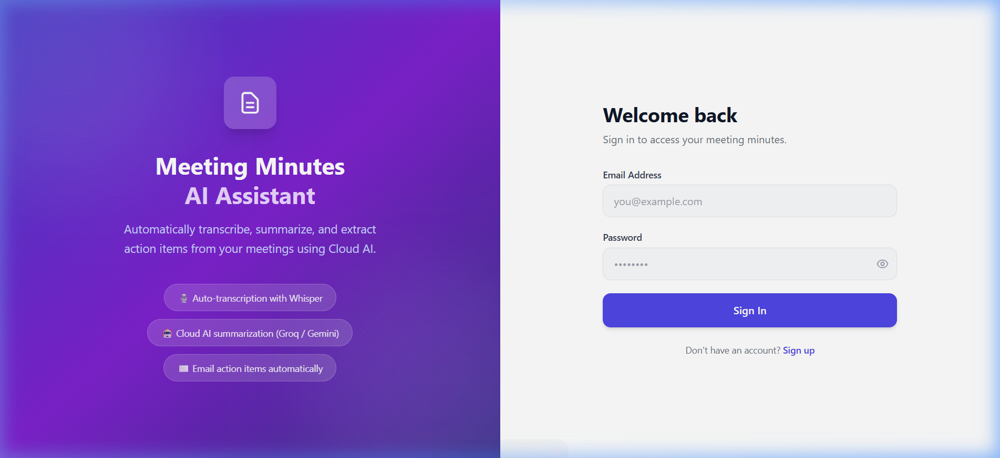
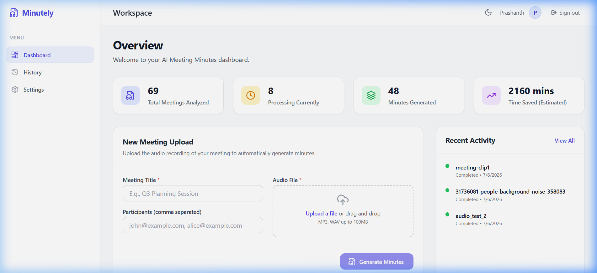
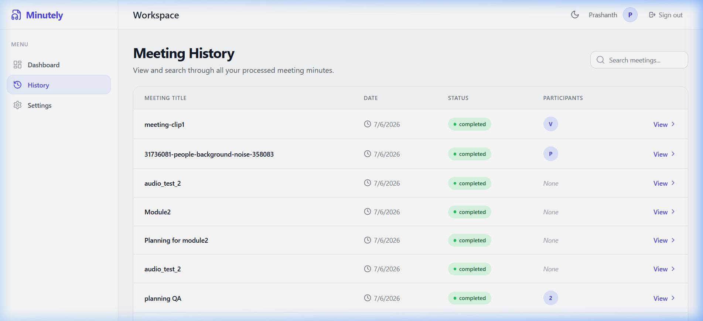
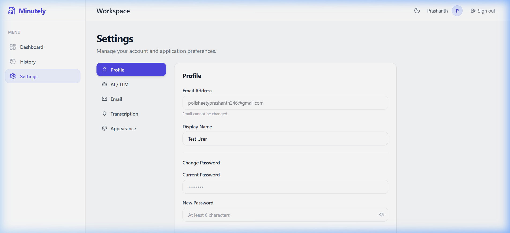
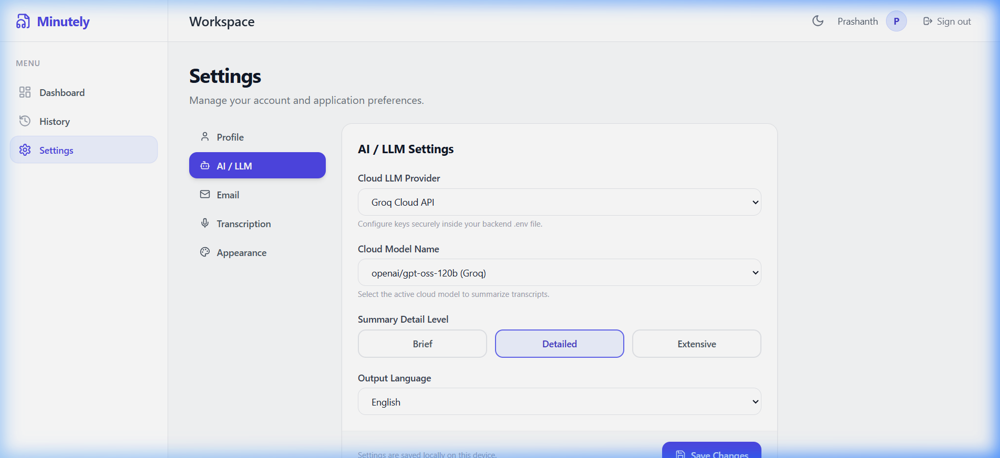
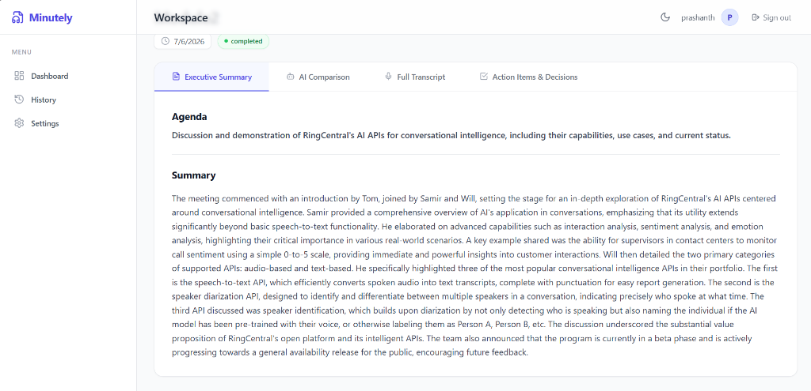
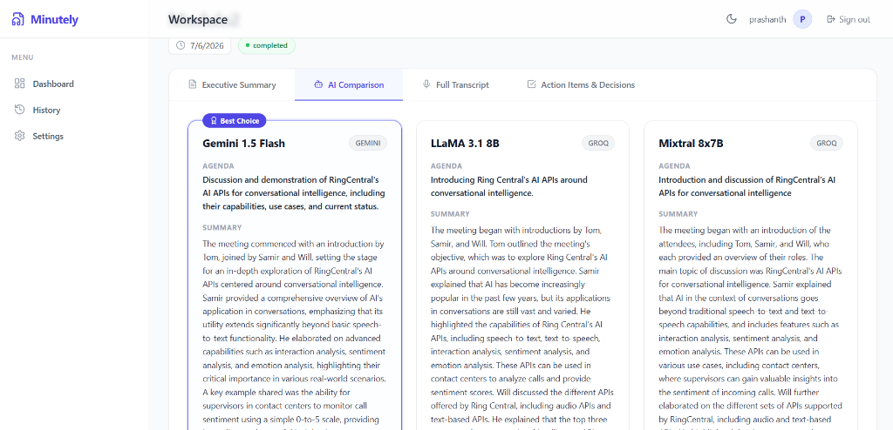
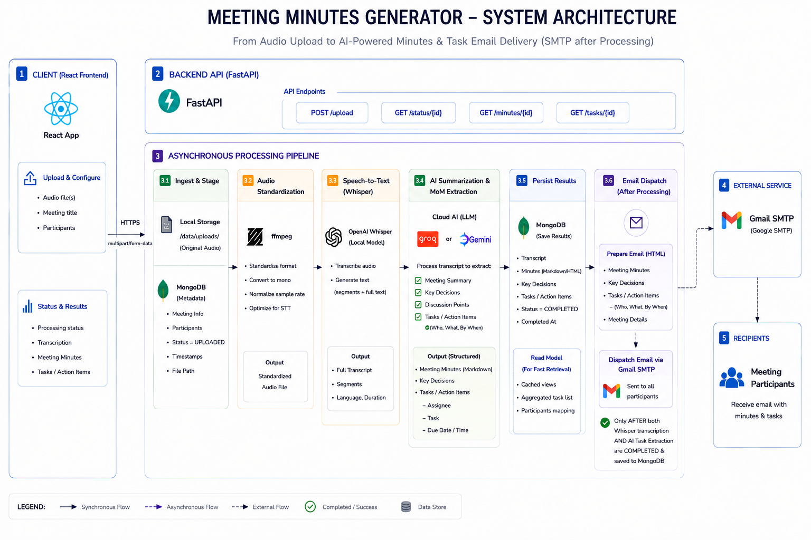

# 🎙️ Autonomous Meeting Minutes Generator

An advanced, self-contained AI-powered application that transcribes meeting audio recordings and automatically extracts structured meeting minutes—including summaries, decisions, action items, and agenda highlights—before distributing them to participants via email.

Built with a modern stack featuring **React (Vite, TypeScript, TailwindCSS)**, **FastAPI (Python)**, **MongoDB**, **OpenAI Whisper (Local)**, and **Cloud LLM APIs (Groq / Google Gemini)**.

---

## 📋 Table of Contents
- [🌟 Key Features](#-key-features)
- [📸 Screen Previews](#-screen-previews)
- [📊 Sample Analyzed Result](#-sample-analyzed-result-multi-llm-consensus)
- [🏗️ System Architecture](#️-system-architecture)
- [🛠️ Tech Stack](#-tech-stack)
- [📁 Project Structure](#-project-structure)
- [🚀 Getting Started](#-getting-started)
  - [🌐 Cloud Deployment (Production)](#-cloud-deployment-production)
  - [Prerequisites](#prerequisites)
  - [1. MongoDB Local Service](#1-mongodb-local-service)
  - [2. Cloud LLM Setup (Groq or Gemini)](#2-cloud-llm-setup-groq-or-gemini)
  - [3. Backend Server Setup](#3-backend-server-setup)
  - [4. Frontend Dashboard Setup](#4-frontend-dashboard-setup)
- [🔗 API Endpoints Contract](#-api-endpoints-contract)
- [⚙️ Environment Variables](#-environment-variables)
- [🔧 Troubleshooting & FAQ](#-troubleshooting--faq)
- [⭐ Support & Rate](#-support--rate)

---

## 🌟 Key Features

* **🎙️ Full-Audio Transcription**: Transcribes complex audio files locally using the OpenAI Whisper `base` model.
* **🧠 Structured MoM Extraction**: Leverages online cloud LLM inference (via Groq API or Google Gemini API) to extract:
  * Comprehensive meeting summary (10+ detailed lines).
  * Key decisions made.
  * Bulleted action items (tasks, owners, and deadlines).
* **✉️ Automated Email Distribution**: Dynamically drafts and dispatches clean, professionally styled HTML emails containing the meeting minutes to all participants upon completion.
* **📊 Modern Web Dashboard**: An interactive React-based UI that lists previous meetings, shows live processing states, and allows drag-and-drop file uploads.
* **🛡️ Self-Contained / Offline-Ready**: Bundles local `ffmpeg.exe` and `ffprobe.exe` binaries for seamless audio conversion without system-level Windows path configuration.

---

## 📸 Screen Previews

### 🔐 User Login
A secure login interface for users to authenticate and access their personal meeting minutes dashboard.


### 📊 Dashboard & Upload
The main workspace dashboard where you can track transcription metrics, view recent activities, and upload new meeting audio recordings.


### ⏳ Meeting History
A detailed overview of all processed and currently processing meetings, allowing you to search and quickly access past minutes.


### ⚙️ Settings & Configuration
The settings panel enables user profile management and configuring Cloud LLM providers (like Groq Cloud API and Google Gemini).
<p align="center">
  
  
</p>

---

## 📊 Sample Analyzed Result (Multi-LLM Consensus)

The application supports a **Multi-LLM Pipeline** where the Whisper transcript is processed by multiple candidate LLMs (e.g., Gemini, LLaMA, Mixtral) in parallel. A **Judge LLM** then reviews the output candidates, selects the best candidate, and provides the reasoning for the selection.

### 🖥️ Dashboard Views of Analyzed Result

The following screenshots illustrate how the application displays the analyzed result in the dashboard interface:

#### 1. Executive Summary & Agenda View
The **Executive Summary** tab displays a high-level **Agenda** along with a detailed meeting **Summary** extracted by the consensus system.


#### 2. Multi-LLM Comparison View
The **AI Comparison** tab compares the meeting minutes generated by all three models (Gemini, LLaMA, and Mixtral), highlighting the selected **Best Choice** as chosen by the Judge LLM.


Below is a real-world example of the structured database output stored in MongoDB for a completed meeting:

```json
{
  "_id": "6a4232e65b0967a388b84177",
  "title": "meeting-clip1",
  "participants": [
    "venkatatheerth@gmail.com"
  ],
  "audio_path": "storage\\audio\\meeting_6a4232e65b0967a388b84177.mp3",
  "status": "completed",
  "transcript": "Zack es gallan tindangad baptized optimization...",
  "agenda": "Unable to determine a specific agenda due to the unintelligible nature of the provided meeting transcript.",
  "summary": "The provided meeting transcript is composed of text that appears to be either severely corrupted, mixed with non-standard characters, or written in a language that is not discernible for meaningful analysis...",
  "action_items": [
    "No specific action items could be identified or assigned due to the unintelligible nature of the meeting transcript."
  ],
  "key_decisions": [
    "No key decisions could be identified or inferred from the provided unintelligible transcript."
  ],
  "best_candidate_index": 0,
  "best_candidate_reasoning": "While none of the candidates provided a perfect summary due to the unintelligible nature of the meeting transcript, Candidate 0 is chosen as the best. This is because it honestly and transparently admits the inability to understand the transcript, providing a clear explanation of the limitations and challenges faced. Unlike the other candidates, it does not introduce speculative or fabricated information...",
  "candidates": [
    {
      "model_name": "Gemini 1.5 Flash",
      "provider": "gemini",
      "model_id": "gemini-2.5-flash",
      "agenda": "Unable to determine a specific agenda due to the unintelligible nature of the provided meeting transcript.",
      "summary": "The provided meeting transcript is composed of text that appears to be either severely corrupted...",
      "action_items": [
        "No specific action items could be identified or assigned due to the unintelligible nature of the meeting transcript."
      ],
      "key_decisions": [
        "No key decisions could be identified or inferred from the provided unintelligible transcript."
      ],
      "error": null
    },
    {
      "model_name": "LLaMA 3.1 8B",
      "provider": "groq",
      "model_id": "llama-3.1-8b-instant",
      "agenda": "Review and discussion of ongoing projects and optimization opportunities.",
      "summary": "Unfortunately, much of the meeting transcript was in a language and format that was not easily decipherable...",
      "action_items": [],
      "key_decisions": [],
      "error": null
    },
    {
      "model_name": "Mixtral 8x7B",
      "provider": "groq",
      "model_id": "llama-3.3-70b-versatile",
      "agenda": "Review and discussion of optimization strategies and their impact on the company's growth",
      "summary": "The meeting began with an introduction to the concept of optimization and its relevance...",
      "action_items": [
        "Develop a comprehensive optimization plan",
        "Assign a team to lead the optimization effort"
      ],
      "key_decisions": [
        "To pursue an optimization strategy to drive company growth",
        "To establish a dedicated team to lead the optimization effort"
      ],
      "error": null
    }
  ]
}
```

### 📝 Human-Readable Output Example

When a meeting is successfully processed, the application renders a clean, professional dashboard view and dispatches a formatted HTML email containing the following details:

---

<div align="center">
  <h2>🎙️ Meeting Minutes: Project Optimization Alignment</h2>
</div>

* **Participants**: `prashanth@gmail.com`
* **Status**: `✅ Completed`
* **Agenda**: Review and discussion of optimization strategies and their impact on the company's growth.

#### 📄 Executive Summary
> The meeting began with an introduction to the concept of optimization and its relevance to the company's current situation. It was noted that the company is facing challenges in terms of growth and that optimization could be a key factor in overcoming these challenges. 
> 
> The attendees discussed the importance of analyzing data and identifying areas where optimization can be applied. They also touched on the need for effective communication and collaboration among team members to ensure successful implementation of optimization strategies. 
> 
> Furthermore, the meeting addressed the topic of change management and the importance of preparing the company for potential changes that may arise. The attendees emphasized the value of continuous learning and improvement, recognizing that optimization is a journey rather than a destination.

#### 🎯 Key Decisions Made
* **Pursue an optimization strategy** to drive company growth and efficiency.
* **Establish a dedicated, cross-functional team** to lead and manage the optimization effort.
* **Allocate additional budget and resources** to support optimization initiatives.
* **Develop a comprehensive communication plan** to engage key stakeholders and align team members.

#### 📋 Action Items & Assigned Tasks
* ⬜ **Develop a comprehensive optimization plan** (Assignee: Project Lead)
* ⬜ **Form and assign the dedicated team to lead the optimization effort** (Assignee: Management / HR)
* ⬜ **Establish a clear timeline for implementation** (Assignee: PMO / Project Lead)
* ⬜ **Identify and allocate necessary resources** (Assignee: Finance / Operations)
* ⬜ **Develop a communication strategy to engage stakeholders** (Assignee: Marketing & Communications)

---

## 🏗️ System Architecture



### 🔄 Data Pipeline Flow
1. **Upload**: React frontend sends audio files and configuration to the FastAPI backend.
2. **Ingest & Stage**: Audio is stored locally, metadata is registered in MongoDB, and an async background task is triggered.
3. **Speech-to-Text (Whisper)**: Local `ffmpeg` standardizes the audio format, and the OpenAI Whisper model transcribes the speech into text.
4. **Task & MoM Extraction (AI Summarization)**: Cloud AI (Groq or Gemini) processes the transcription text to extract structured meeting minutes, key decisions, and specifically compiles the list of **tasks/action items** (including who needs to do what and by when).
5. **SMTP Email Dispatch**: *Only* after both the Whisper transcription and AI task-extraction are fully complete and saved to MongoDB, the backend drafts the HTML email and dispatches the task list and minutes to all participants.

---

## 🛠️ Tech Stack

| Component | Technology | Purpose / Notes |
| :--- | :--- | :--- |
| **Frontend** | React (Vite), TypeScript, TailwindCSS | User interface, drag-and-drop upload, status tracker, meeting view |
| **Backend** | FastAPI (Python 3.10+) | High-performance asynchronous API, background workers |
| **Database** | MongoDB Community Server (v8+) | Persistent storage for meeting metadata, transcripts, and minutes |
| **Audio Processing** | PyDub | Formats incoming audio files into standard PCM WAV formats |
| **Speech-to-Text** | OpenAI Whisper (Local) | Secure, offline speech recognition (runs on local CPU/GPU) |
| **LLM Inference** | Groq API / Google Gemini API | Cloud-based structured JSON generation for summary, decisions, and tasks |
| **Email Service** | SMTP | Sends auto-generated emails (supports Gmail App Passwords) |

---

## 📁 Project Structure

```
meeting-minutes-generator/
├── frontend/               # React client application (Vite + TS)
│   ├── src/
│   │   ├── components/     # UI elements (Dashboard, Upload, MeetingView)
│   │   ├── services/       # apiClient modules (backend endpoints mapping)
│   │   ├── App.tsx         # App routing and layout skeleton
│   │   └── main.tsx        # React client entrypoint
│   ├── package.json        # NPM dependencies
│   ├── tailwind.config.js  # Styling guidelines
│   └── tsconfig.json       # TypeScript configuration
│
├── backend/                # FastAPI application
│   ├── config/             # Settings configuration & env loading
│   ├── database/           # MongoDB Client configurations
│   ├── models/             # Schema definitions
│   ├── routes/             # Endpoints (meetings, email dispatches)
│   ├── services/           # Pipelines (transcription, llm summarizer, SMTP)
│   ├── utils/              # Audio formatting and validation
│   └── main.py             # FastAPI server entry point
│
├── storage/                # Runtime file storage (auto-created)
│   ├── audio/              # Uploaded raw files
│   ├── transcripts/        # Raw Whisper .txt outputs
│   └── output/             # Final generated minutes
│
├── ffmpeg.exe              # Bundled local video/audio transcoder binary
├── ffprobe.exe             # Bundled local audio analyzer utility
├── requirements.txt        # Backend dependencies
└── .env                    # Secrets & connection credentials (not tracked)
```

---

## 🚀 Getting Started

### 🌐 Cloud Deployment (Production)
For hosting the application in the cloud (using MongoDB Atlas, Render, and Vercel), see the step-by-step [Cloud Deployment Guide](deployment_guide.md).

### Prerequisites
* **Python 3.10 or 3.11**
* **Node.js 18+**
* **MongoDB Community Server** installed and running on default port `27017`

---

### 1. MongoDB Local Service
Ensure MongoDB is running as a local service:
* **Windows**: Open `Services.msc`, locate `MongoDB Server (MongoDB)`, and ensure its status is **Running**.
* You can verify connection details using MongoDB Compass at `mongodb://localhost:27017`.

---

### 2. Cloud LLM API Setup (Groq or Gemini)
The project runs cloud-based LLM APIs to perform structured summarization without loading your local computer's processor.

1. **Groq Setup**:
   * Create an account at [console.groq.com](https://console.groq.com/).
   * Navigate to **API Keys** and click **Create API Key**.
   * Copy the key and add it to your `.env` file as `GROQ_API_KEY`.
2. **Gemini Setup**:
   * Get a Google Gemini API Key from Google AI Studio.
   * Add it to your `.env` file as `GEMINI_API_KEY`.

### 3. Backend Server Setup

1. Install the required Python packages:
   ```powershell
   pip install -r requirements.txt
   ```
2. Set up your environment variables by creating a `.env` file (see [Environment Variables](#-environment-variables) below).
3. Run the FastAPI development server:
   ```powershell
   python -m uvicorn backend.main:app --reload
   ```
   *The backend documentation will be accessible at: http://localhost:8000/docs*

---

### 4. Frontend Dashboard Setup
1. Open a new terminal and navigate to the frontend directory:
   ```powershell
   cd frontend
   ```
2. Install dependencies:
   ```powershell
   npm install
   ```
3. Start the Vite development server:
   ```powershell
   npm run dev
   ```
4. Access the web interface in your browser:
   * **URL**: http://localhost:5173

---

## 🔗 API Endpoints Contract

All endpoints are prefixed with `/api`.

### Meetings Group (`/api/meetings`)

#### `POST /upload`
Uploads an audio file and triggers the transcription and summary pipeline in the background.
* **Request Content-Type**: `multipart/form-data`
* **Form Fields**:
  * `title` (string, required): Title of the meeting.
  * `participants` (string, optional): Comma-separated list of participant emails (e.g., `test1@domain.com, test2@domain.com`).
  * `file` (binary, required): Audio file (e.g. `.mp3`, `.wav`, `.m4a`).
* **Response (200 OK)**:
  ```json
  {
    "message": "Meeting successfully uploaded. Processing has begun.",
    "meeting_id": "647f2a1b9c9f0b12a456789a"
  }
  ```

#### `GET /`
Lists all meetings stored in the database, ordered from newest to oldest.
* **Response (200 OK)**:
  ```json
  {
    "meetings": [
      {
        "_id": "647f2a1b9c9f0b12a456789a",
        "title": "Project Alignment Call",
        "participants": ["test@example.com"],
        "audio_path": "c:\\...\\meeting_647f2a1b9c9f0b12a456789a.mp3",
        "status": "completed",
        "transcript": "Hello team, let's start...",
        "summary": "Full summary details...",
        "action_items": ["Action item 1"],
        "key_decisions": ["Decision 1"],
        "error": null
      }
    ]
  }
  ```

#### `GET /{meeting_id}`
Retrieves detailed information for a single meeting by its MongoDB ObjectId.
* **Response (200 OK)**: Standard meeting JSON structure (as shown in the list response).
* **Errors**: `404 Not Found` (meeting doesn't exist) or `400 Bad Request` (invalid ID format).

---

### Email Group (`/api/email`)

#### `POST /resend/{meeting_id}`
Manually triggers the background worker to resend the meeting minutes HTML email to the listed participants.
* **Response (200 OK)**:
  ```json
  {
    "message": "Email dispatch triggered successfully"
  }
  ```

---

## ⚙️ Environment Variables

Create a file named `.env` in the root `meeting-minutes-ai/` directory.

```ini
# Database Configuration
MONGO_URI=mongodb://localhost:27017/meeting_minutes_db

# LLM Provider selection: gemini, groq
LLM_PROVIDER=groq

# Google Gemini API
GEMINI_API_KEY=your_gemini_api_key_here
GEMINI_MODEL=gemini-1.5-flash

# Groq API Configuration
GROQ_URL=https://api.groq.com/openai/v1/chat/completions
GROQ_MODEL=llama-3.1-8b-instant
GROQ_API_KEY=your_groq_api_key_here

# Email Configuration (SMTP)
SMTP_HOST=smtp.gmail.com
SMTP_PORT=587
SMTP_USER=your_email@gmail.com
SMTP_PASS=your_gmail_app_password
```

> [!TIP]
> **To configure Gmail SMTP**:
> 1. Turn on Multi-Factor Authentication (MFA) on your Google account.
> 2. Go to Account Settings -> Security -> App Passwords.
> 3. Generate a password for "Mail" / "Other" and paste the 16-character code into your `SMTP_PASS` field.

---

## 🔧 Troubleshooting & FAQ

#### Q: The transcription keeps failing or outputting empty transcripts.
* **Check local binaries**: Ensure `ffmpeg.exe` and `ffprobe.exe` are located in your root `meeting-minutes-ai` folder.
* **Corrupt audio file**: If the uploaded audio file size is under 1KB, transcription will abort early. Make sure the file actually contains audio recording data.

#### Q: The summarization/minutes screen shows "AI Summarization Failed".
* **Verify API keys**: Ensure either `GROQ_API_KEY` or `GEMINI_API_KEY` is configured correctly in your `.env` file, and that your internet connection is active.
* **Check provider setting**: Check that `LLM_PROVIDER` in your `.env` is set to the correct provider (`gemini` or `groq`).

#### Q: Why is my transcription step slow?
* **Whisper execution**: Running Whisper locally on a CPU can take several minutes depending on the meeting length. If you have an NVIDIA GPU, make sure `CUDA` is properly installed to leverage GPU acceleration in PyTorch.

---

## ⭐ Support & Rate

If you find this project helpful, please consider **rating** it and giving it a **Star** on GitHub! Your support helps make the project more visible and motivates further enhancements.

1. Navigate to the top of the repository page.
2. Click the ⭐ **Star** button in the top right corner.
3. If you have any feedback or ideas, feel free to open an issue or submit a pull request!
